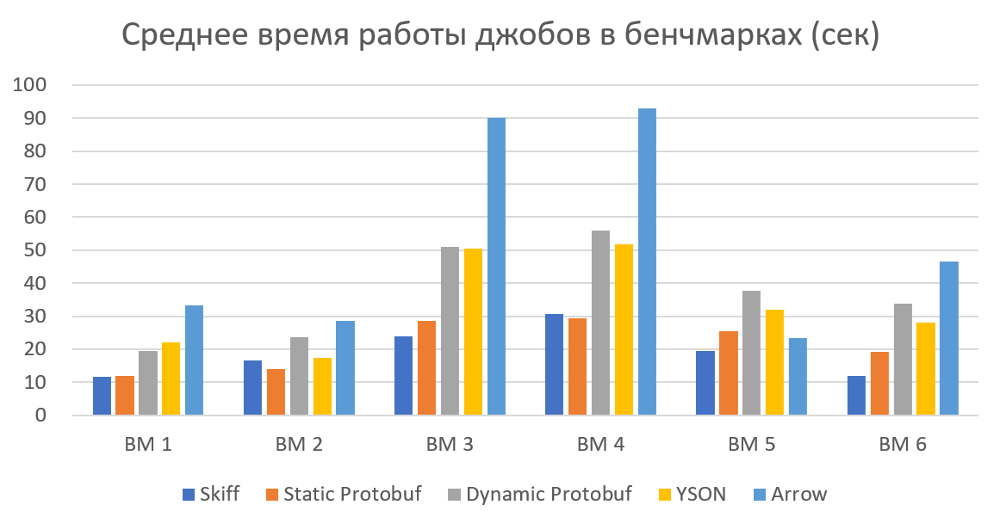

# Тестирование эффективности форматов
## Мотивация

В рамках работы было проведено тестирование эффективности использования разных
форматов данных в различных сценариях. Целью такого тестирования является выявление
характерных сценариев, в которых предпочтительно использование того или иного формата.
Это позволит составить список рекомендаций по выбору формата в зависимости от специфики конкретной ситуации.

Некоторые сценарии могут накладывать жёсткие ограничения на возможные для использования форматы. Например, если схема таблицы становится известна только в рантайме, использовать статический Protobuf не получится. Также, если таблица не является
строго схематизированной и её непосредственную схему невозможно получить на клиентской
стороне даже в рантайме, то любые схематизированные форматы (Protobuf, Skiff, Arrow) не
могут быть использованы.

В контексте данного сравнения под эффективностью формата подразумевается производительность программ при работе с ним, в частности скорость MapReduce-операций,
производимых с использованием формата. Тем не менее, существует множество других факторов, отличных от производительности, которые могут влиять на выбор формата в конкретной ситуации, например скорость разработки или простота интеграции со сторонними
библиотеками и системами. Таким образом, результаты эффективности, полученные в данном тестировании, не являются безусловными рекомендациями по выбору формата. Для
выбора наилучшего решения требуется комплексный анализ конкретной ситуации.

## Общее описание тестирования

Тестирование форматов (бенчмаркинг) производилось по следующим правилам:

1. Реализовано несколько бенчмарков, симулирующих различные сценарии работы с данными;

2. Все бенчмарки представляют из себя запуски Map-операций, реализующих одинаковую
логику работы с таблицами независимо от формата;

3. Все операции исполняются одинаковым количеством джобов (10);

4. Операции запускаются над одними и теми же таблицами независимо от формата и
итерации;

5. Таблицы для тестов наполняются случайными данными, сгенерированными специальным скриптом;

6. Статистика формируется на основании нескольких запусков операций и всех их джобов;

7. Статистика производительности джобов считается в YTsaurus UI;

8. Тестирование производится на удалённо развёрнутом кластере (k8s + Яндекс.Облако);

Основной метрикой эффективности формата было выбрано среднее время работы джобов в рамках бенчмарка. Изначально в общую статистику планировалось также включить
и объём потребляемой джобами оперативной памяти. Однако, результаты показали, что эта
метрика для всех проводимых операций примерно одинакова. Это связано с тем, что во всех
тестах данные читаются построчно (а размер arrow-батчей относительно небольшой) и нигде
не накапливаются. Такой подход соответствует концепции распределённых операций: работа с большими данными предполагает их раздельную обработку без накопления в памяти
целых строк.

## Бенчмарки и результаты

Бенчмарки составлялись таким образом, чтобы оценить непосредственно эффективность чтения, записи и представления в памяти программы данных в различных форматах.
Map-операции для тестов разработаны таким образом, чтобы основную нагрузку в них составляли именно I/O-операции и работа с объектными представлениями данных. В связи
с этим джобы в бенчмарках, как правило, не производят с данными сложных вычислений
и не включают работу с компонентами, не касающимися непосредственно тестов. Различные бенчмарки ставят основной акцент отдельно на чтении данных, обращении к данным
в программном представлении, изменении данных в программной представлении и запись
данных.

Помимо разных сценариев работы внутри операций бенчмарки охватывают также
различные структурные особенности таблиц и их данных (схемы, типы).

Таким образом, для тестирования форматов на эффективность было написано 6 бенчмарков, воспроизводящих специфические сценарии работы:

1. **Чтение больших числовых данных**. В рамках данного бенчмарка симулируется
обработка большого количества числовых данных с целью формирования некоторой
статистики. Для этого была сгенерирована таблица, содержащая 1000 колонок с целыми и дробными числами разной битности. Логика написанных для теста Map-операций
включает в себя интенсивное обращение к данным (происходит непосредственное обращение к каждому полю каждой строки). В качестве статистики считается количество
равных нулю чисел в таблице. Таким образом, при полном чтении и декодировании
таблиц объём данных на запись минимален.

2. **Чтение таблиц с малым количеством колонок**. В отличие от предыдущего бенчмарка представляет работу с другим специфическим видом таблиц: всего две колонки
числового и строкового типов. Так же, как и в первом примере, программа читает и
декодирует данные в полном объёме, считая по ним тривиальную статистику (в данном
случае суммарную длину в байтовом представлении).

3. **Простая модификация таблицы**. Для данного теста используется «средняя» таблица, состоящая из 10 колонок с числами и строками. Map-операция читает таблицу
построчно и, инкрементируя число в одной из колонок, записывает строку без других
изменений в выходную таблицу.

4. **Более сложная модификация таблицы.** Используется та же таблица, что и в
предыдущем примере, однако модификация не просто меняет числовое поле, а добавляет в строку новое и записывает в него данные. Все строки с применённой модификацией записываются в выходную таблицу с новой схемой.

5. **Работа со сложными типами.** Данный бенчмарк проверяет, насколько эффективно
сложные типы сериализуются и представляются в программе при использовании различных форматов. Входная таблица содержит поля типов Optional<string>, List<double>,
Struct и Dict. Map-операция читает строки и модифицирует одно из полей – список. Все
числа-элементы списка инкрементируются, а также в конец списка добавляется новое
число. После такой модификации строка передаётся на запись

6. Запись без чтения. Тестируется скорость, с которой данные в различных форматах
сериализуются и записываются в выходной поток. Создаётся объектное представление 
строки со схемой, аналогичной таблицам из бенчмарков 3 и 4. Далее строка наполняется
заранее определёнными данными и отправляется на запись

По результатам тестирования была собрана статистика суммарного времени работы
(в секундах) джобов в операциях:

## Замечания

• *Тестирование форматов проводилось НЕ через предлагаемый библиотекой общий интерфейс*. Для тестов использовались более низкоуровневые механизмы работы. Повторные тесты показывают, что использование дополнительной прослойки в виде интерфейса в среднем снижает скорость работы с каждым поддерживаемым форматом на 10-15%. Таким образом, использование статического prptobuf может быть эффективнее в тех случаях, где его отставание от Skiff в тестах невелико.

• В 4-м бенчмарке для формата Skiff в таблице указано время работы при добавлении
новой колонки в конец таблицы. Однако, результат теста будет отличается в зависимости от того, добавляется новая колонка в конец таблицы или в середину. Это связано с особенностями хранения сериализованных данных в Skiff-реализации (см. раздел
Реализации форматов): при добавлении данных в конец буфера полная пересборка сериализации не требуется. Таким образом, при условии, что новая строка добавляется
не в конец, а в середину табличной схемы, среднее время работы Skiff падает на 8%
и составляет 30,4 секунды. Такой результат в свою очередь уже уступает статическому Protobuf (29,5 секунд), скорость работы которого не зависит от позиции в схеме
сообщения, куда добавляются новые данные.

• Все результаты, представленные в сводной таблице, были получены при тестировании
на YT-таблицах в режиме Optimized for Lookup. Однако, формат Arrow более эффективен для чтения таблиц в режиме Optimized for Scan (поколоночное хранение вместо
построчного). Изменение схемы хранения входных таблиц практически не влияет на
эффективность остальных форматов, однако время работы джобов операций, использующих формат Arrow, сокращается в среднем на 15%.

• Формат Arrow в зависимости от оригинальности данных в каждой колонке может использовать словарное сжатие (см. реализацию Arrow). Так как табличные данные для
тестов генерировались случайным образом, эта форматная оптимизация не использовалась. Однако, при аналогичном тестировании на данных, содержащих большое количество повторений, средняя скорость операций с Arrow может возрастать до 8-9 раз (в
зависимости от количества уникальных значений в каждой колонке). При этом уровень
уникальности данных в столбцах таблицы не влияет на скорость других форматов.

• Размер сериализации данных (то есть объём сырых данных, передаваемых между узлами распределённой системы) в различных форматах сильно отличается. Например,
по отношению к YSON-сериализации одних и тех же таблиц protobuf в среднем эффективнее кодирует данные на 18%, а Skiff и Arrow на 34% (в проведённых тестах).
Даже при тестировании с искусственным ограничением скорости сети до 10 Мбит/с,
скорость передачи данных в любом формате кратно превышает скорость их обработки джобом, что не даёт ей стать «бутылочным горлышком» системы. Тем не менее,
теоретически возможны сценарии, в которых скорость передачи данных по сети будет
ограничена ещё сильнее. В таком случае эффективность сериализации может влиять
на выбор формата.

• В более ранних версиях YTsaurus динамический Protobuf показывал эффективность
сопоставимую со статической версией (разница не превышает 5%). Тем не менее, в более новых релизных версиях YT его эффективность значительно снизилась. Это может
быть связано с переходом на новую версию Protobuf или с какими-либо иными изменениями в YTsaurus.

## Выводы

В ходе работы было разработано и проведено 6 тестов, оценивающих эффективность
использования форматов YSON, Skiff, Static Protobuf, Dynamic Protobuf и Arrow. В качестве метрики эффективности использовалось среднее время работы джобов, выполняющих
Map-операции с использованием форматов. На основании полученных данных, а также некоторых дополнительных теоретических выкладок были сделаны выводы об эффективности
протестированных форматов в различных сценариях.

• В подавляющем большинстве сценариев лидирующими форматами по скорости стали
Skiff и статический (прекомпилированный) Protobuf.

– **Skiff** оказался наиболее эффективным при чтении таблиц с большим количеством
    колонок фиксированного размера, в Map-операциях модифицирующих табличные
    строки, не меняя размер сериализации (напр. изменения чисел) и при работе со
    сложными типами данных. Также Skiff кратно превосходит остальные форматы
    по скорости записи данных.

– Незначительно лучшие результаты, чем Skiff показывает **статический вариант
    Protobuf** при работе с таблицами, имеющими малое количество колонок (1-5),
    включая колонки строчного типа. Также, статический Protobuf может оказаться
    наиболее эффективным форматом в операциях, изменяющих данные строк таким
    образом, что оптимизации skiff не работают.

– В сценариях работы, предполагающих знание схемы всех таблиц на этапе компиляции, а также, не требующих работы со сложными типами данных и объёмах
    записи данных, кратно превышающих чтение, форматы Skiff и Static Protobuf оказываются примерно равны по эффективности. Тем не менее, если схема таблиц
    содержит колонки сложных типов, а также в сценариях, где работают различные
    оптимизации для Skiff в разработанной библиотеке, формат Skiff может значительно превосходить Protobuf по скорости.

– При работе с таблицами, схема которых неизвестна заранее (на этапе компиляции),
    использование статического Protobuf невозможно. В отличие от статической версии Protobuf, Skiff не требует описания табличных схем где-либо вручную. Вместо
    этого схема таблицы получается из системного атрибута в рантайме и интерпретируется динамически.

• **Формат YSON** показал средние результаты по эффективности во всех тестах. Формат
предлагает широкую совместимость с различными компонентами библиотеки YTsaurus
(и некоторыми другими разработками Яндекса) и может использоваться в сценариях,
предусматривающих использование сторонних компонентов, поддерживающих его.

• **Динамический Protobuf** в современных версиях YTsaurus в большинстве сценариев
проигрывает по эффективности даже YSON. Его использование может быть оправдано
с точки зрения эффективности только на более старых версиях YT (ещё до релиза в
open-source).

• **Apache Arrow** в большинстве тестов сильно отстаёт от по скорости работы с ним от
других форматов. Запись в формате Arrow на данный момент имеет серьёзные ограничения со стороны серверной части YT, вследствие чего использование формата для
записи крайне неэффективно. Однако, эффективность Arrow может значительно возрастать при работе с таблицами, имеющими большое количество повторяющихся значений в колонках, благодаря сжатию данных на уровне формата. В подобных сценариях Arrow может оказываться самым эффективным решением. Для выявления более
точных значений характеристик таблиц с данными, при которых использование Arrow
становится предпочтительным, требуются дополнительные исследования с тестами.

• В настоящий момент форматы Protobuf и Arrow не имеют полной совместимости типов
данных с YT, вследствие чего их использование для работы с таблицами, содержащими
колонки таких типов, как json, datetaime, uuid и др. невозможно. Полную поддержку
типов обеспечивают только форматы YSON и Skiff (из рассматриваемых).